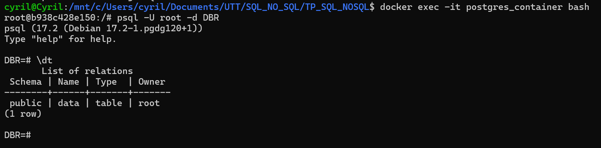
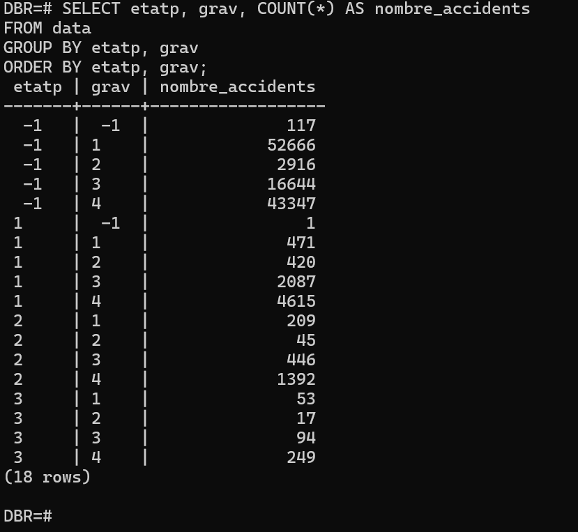
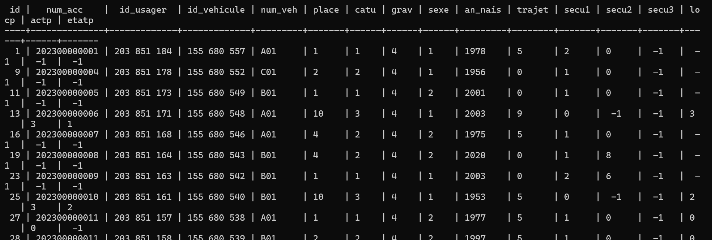
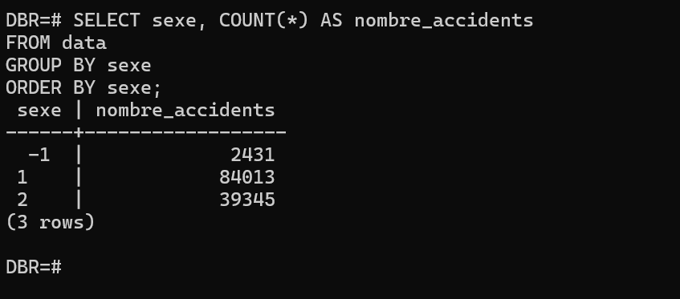
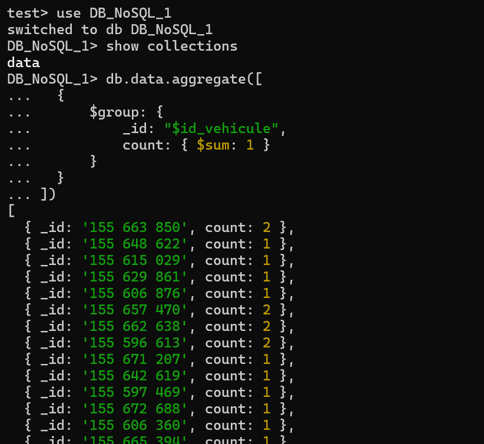
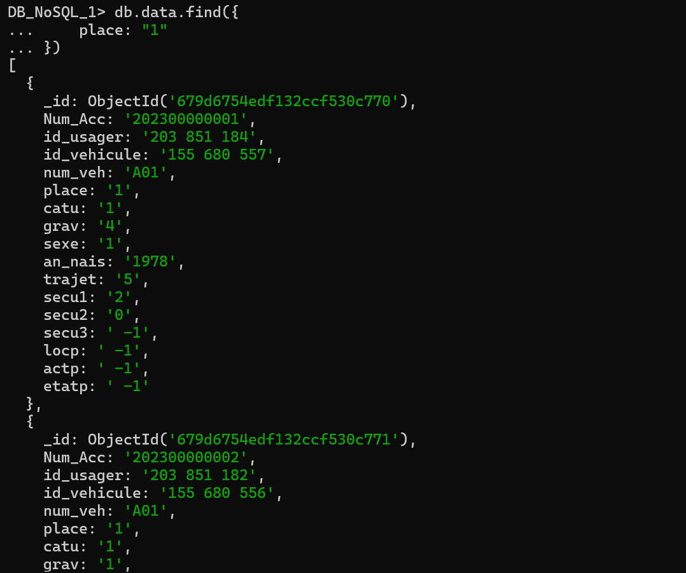
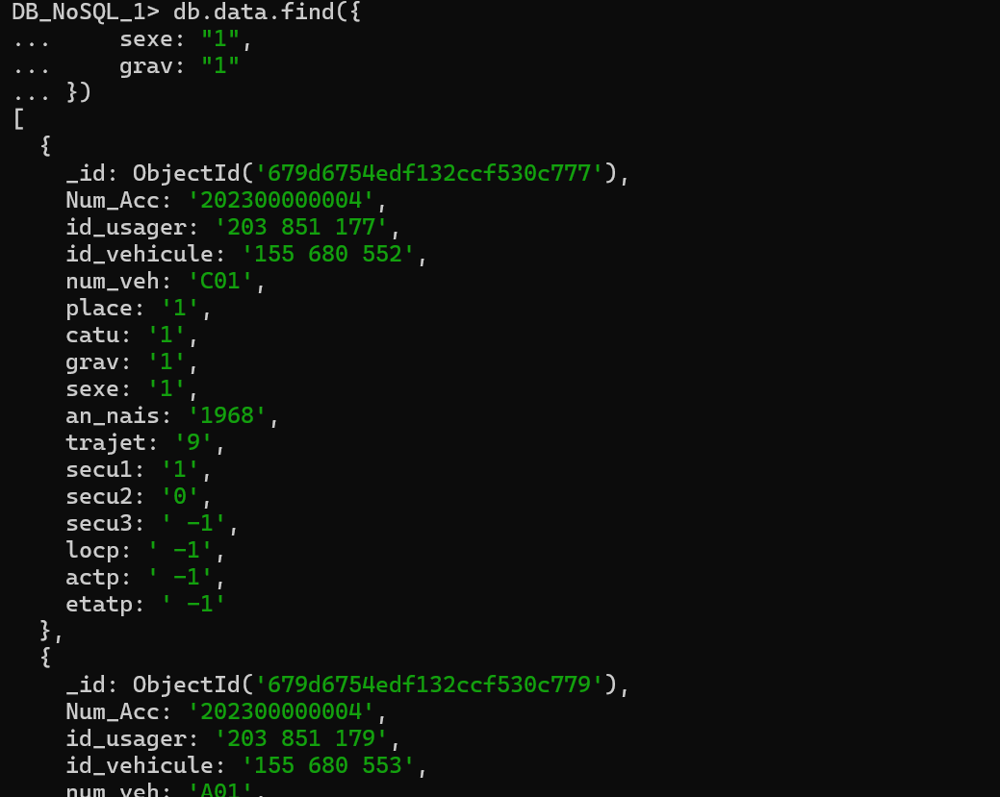
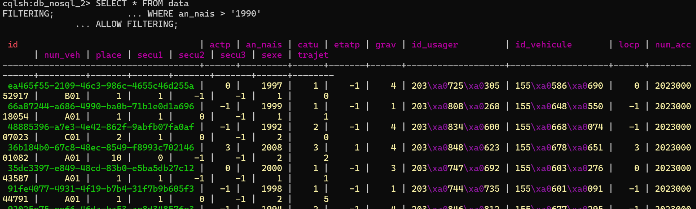
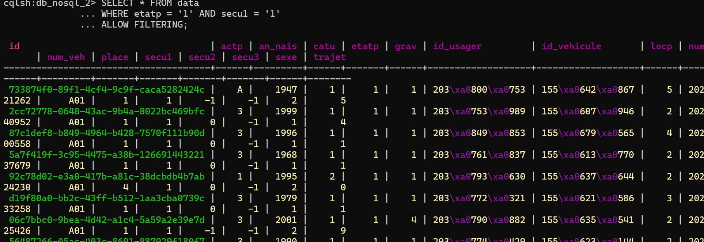

# Importation de Données vers PostgreSQL, MongoDB et Cassandra

## Description
Ce projet permet d'importer des données depuis un jeu de données au format CSV vers trois bases de données différentes :
- **PostgreSQL** (relationnelle)
- **MongoDB** (NoSQL orienté documents)
- **Cassandra** (NoSQL orienté colonnes)

L'importation est réalisée à l'aide de **Python** et de bibliothèques spécifiques à chaque base de données. L'environnement est géré avec **Docker**.

## Prérequis
Assurez-vous d'avoir les éléments suivants installés:
- **Docker** et **Docker Compose**
- **Python 3.x**
- **pip** et les dépendances listées dans `requirements.txt`

## Installation
### 1. Cloner le dépôt
```sh
git clone https://github.com/votre-repo.git
cd path-jusqu-au-dossier du projet
```

## Structure du Projet

```
📂 votre-repo/
 ├── 📄 docker-compose.yml      # Configuration Docker pour orchestrer les services
 ├── 📄 requirements.txt        # Dépendances Python
 ├── 📄 Makefile                # Automatisation des commandes
 ├── 📂 dockerfiles/            # Dockerfiles pour chaque service
 │   ├── 📄 cassandra.Dockerfile
 │   ├── 📄 mongo.Dockerfile
 │   ├── 📄 postgres.Dockerfile
 ├── 📂 scripts/                # Scripts d'importation et manipulation des données
 │   ├── 📄 import_postgres.py
 │   ├── 📄 import_mongo.py
 │   ├── 📄 import_cassandra.py
 │   ├── 📄 utils.py             # Fonctions utilitaires communes
 ├── 📂 data/                    # Données sources (CSV, JSON, etc.)
 │   ├── 📄 usagers-2023.csv
 │   
 ├── 📂 assets/                  # Ressources supplémentaires (ex: images, documentation)
 ├── 📂 notebooks/               # Jupyter Notebooks pour analyse exploratoire
 ├── 📂 tests/                   # Tests unitaires et d’intégration
 │   ├── 
 ├── 📂 venv/                    # Environnement virtuel Python
 ├
 ├
 ├── 📄 .gitignore               # Fichiers et dossiers à ignorer par Git
 ├── 📄 README.md                # Documentation du projet
```

### 2. Lancer les conteneurs Docker
```sh
docker-compose up -d
```
Cela démarre PostgreSQL, MongoDB et Cassandra.

### 3. Installer les dépendances Python
```sh
make setup
make install
```

## Utilisation
### 1. Importer les données

Les scripts python sont directement executer au moment de la création des contener.

### 2. Exécustion des requêtes et les resultats
- **PostgreSQL** :
Accéder au conteneur pour executer les requêtes 

  ```sh
  docker exec -it postgres_container bash
  psql -U root -d DBR
  \dt
  ```
  


------------------- Requetes et resultats ---------------

#### 1.  nombre d'accidents par état du piéton et par gravité

  ```sh
SELECT etatp, grav, COUNT(*) AS nombre_accidents
FROM data
GROUP BY etatp, grav
ORDER BY etatp, grav;
  ```



#### 2.  nombre d'accidents par état du piéton et par gravité

  ```sh
SELECT *
FROM data
WHERE grav = '4';
  ```


#### 3.  Calculer la répartition des accidents par sexe des usagers

  ```sh
SELECT sexe, COUNT(*) AS nombre_accidents
FROM data
GROUP BY sexe
ORDER BY sexe;
  ```


- **MongoDB** :

Accéder au conteneur pour executer les requêtes 

  ```sh
  docker exec -it $(docker ps -qf "ancestor=tp_sql_nosql-mongo") mongosh
  ```
Accéder à la base de données DB_NoSQL_2 et lister les collection pour vérifier la presence de data

  ```sh
use DB_NoSQL_1
show collections
  ```

------------------- Requetes et resultats ---------------

#### 1. nombre d'accidents par type de véhicule. 

  ```sh
db.data.aggregate([
    {
        $group: {
            _id: "$id_vehicule",  
            count: { $sum: 1 }     
        }
    }
])
  ```


#### 2. Les accidents qui ont eu lieu dans la zone géographique place = 1 

  ```sh
db.data.find({
    place: "1"   
})
  ```



#### 3. Informations des accidents impliquant un usager de sexe féminin et ayant une gravité "légère"

  ```sh
db.data.find({
    sexe: "1",   
    grav: "1"   
})
  ```


- **Cassandra** :
Accéder au conteneur pour executer les requêtes 

  ```sh
  docker exec -it cassandra_container bash
  cqlsh
  ```
Accéder keyspace  DB_NoSQL_2  

 ```sh
DESCRIBE KEYSPACES;
USE DB_NoSQL_2;
DESCRIBE TABLES;
  ```
Accéder au conteneur pour executer les requêtes 

  ```sh
  docker exec -it $(docker ps -qf "ancestor=tp_sql_nosql-mongo") mongosh
  ```
Accéder à la base de données DB_NoSQL_2 et lister les collection pour vérifier la presence de data

  ```sh
use DB_NoSQL_1
show collections
  ```

------------------- Requetes et resultats ---------------

#### 1. nombre d'accidents par équipement de sécurité et par gravité

  ```sh
SELECT secu1, grav, COUNT(*) AS nombre_accidents
FROM data
GROUP BY secu1, grav
ALLOW FILTERING;
  ```

#### 2. Les accidents impliquant des jeunes conducteurs (année de naissance après 1990)

  ```sh
SELECT * FROM data
WHERE an_nais > '1990'
ALLOW FILTERING;
  ```


#### 3. nombre d'accidents par équipement de sécurité et par gravité

  ```sh
SELECT * FROM data
WHERE etatp = '1' AND secu1 = '1'
ALLOW FILTERING;
  ```




## Configuration


## Problèmes rencontrés et solutions
1. **Lignes mal formatées dans le CSV** : filtrage des lignes invalides avant l'insertion.
2. **Connexion aux bases échouée** : vérification des conteneurs Docker avec `docker ps`.

## Auteurs


## Licence

